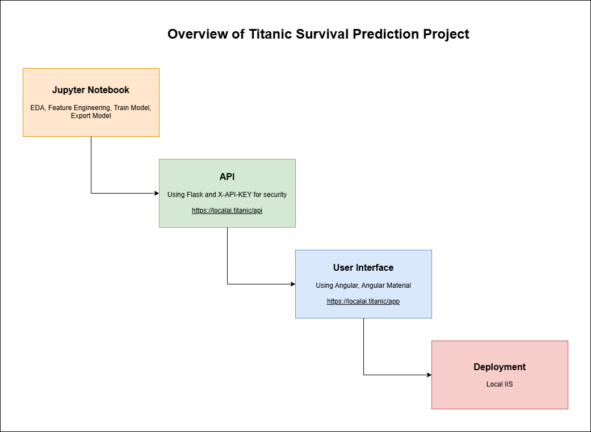
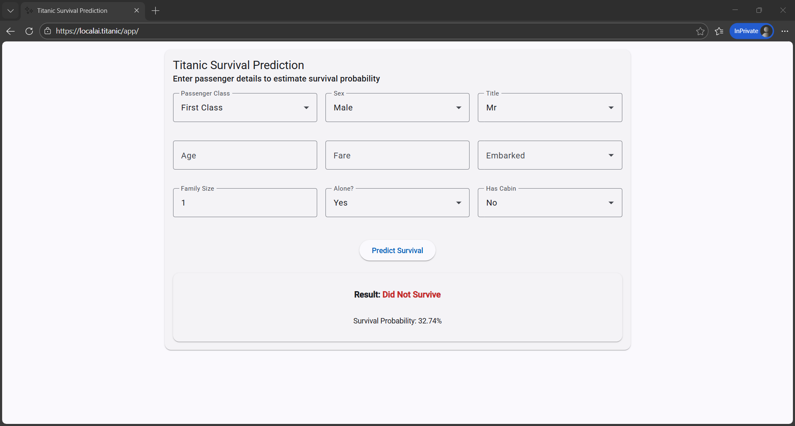
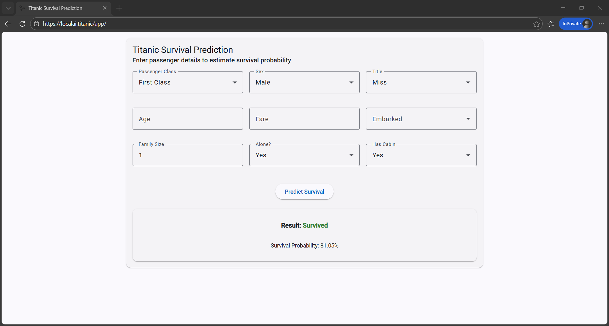

# Titanic Survival Prediction

An end-to-end machine learning project that trains a survival prediction model using the Titanic dataset and deploys it as a secured REST API with a web UI.

## Folder Structure

<table style="width:100%">
    <tr>
        <th style="width:30%">Name</th>
        <th>Description</th>
    </tr>
    <tr>
        <td>api</td>
        <td>Flask API which include <code>/health</code> and <code>/predict</code> endpoints. Added basic security using <code>X-API-KEY</code></td>
    </tr>
    <tr>
        <td>artifacts</td>
        <td>Exported model file(s) that trained in jupyter notebook</td>
    </tr>
    <tr>
        <td>assets</td>
        <td>Screenshots for demo</td>
    </tr>
    <tr>
        <td>data</td>
        <td>Raw data file (csv)</td>
    </tr>
    <tr>
        <td>frontend</td>
        <td>Angular project for end-user prediction UI</td>
    </tr>
    <tr>
        <td>notebooks</td>
        <td>Jupyter notebook file that include data exploraration, feature engineering, model training, and model evaluation</td>
    </tr>
    <tr>
        <td>postman</td>
        <td>Postman collection for prediction api that make easy to test by importing the collection</td>
    </tr>
</table>

## Screenshots

### Survived

### Not Survived

https://github.com/user-attachments/assets/4d9939db-0023-4606-8621-d0abca6cd8a1
